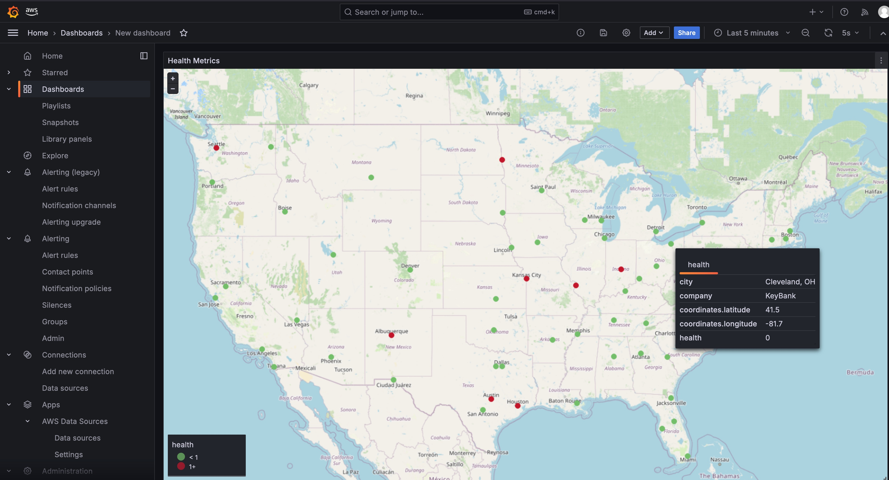

# SEU Fleet Telemetry Demo

The POC demonstrates collecting, storing, and visualizing remote broker telemetry
data. The brokers are considered a fleet of sensors. The sensor data from a
global fleet is handled as a data stream, stored as time series, and visualized
in a dashboard.

This is a common design problem for business cases where where there are large
numbers of sensors emitting data like IoT, healthcare or industrial automation.
There are numerous solution architectures available. Most public cloud providers
have built dedicated blueprints and services to address the business need (AWS
IoT, Azure IoT, GCP Connected Devices).

## Architecture

The architecture is comprised of two sections.

1. Sensor simulator
2. Data streaming architecture

The sensor simulator uses EventBridge events (CloudWatch events). There is one
event for each city in the simulation. The events fire every minute. The
events target a lambda and send a payload with the city, company, and geo
coordinates. The lambda simulates a health status with a predefined probability
distritbution (15% unhealthy). Then the simulation connects to the data
streaming architecture via the API gateway.

The data streaming architecture receives sensor data on the api gateway
(`/telemetry`). The telemetry api method is routed to a lambda that puts the
event data into Kinesis Firehose. Firehose then writes the data to
OpenSearch.

There is an AWS Managed Grafana dashboard that uses a geomap to show the health
of the brokers at customer sites overlayed on a map of the USA. Grafana uses
OpenSearch as a data source. Grafana uses SAML authentication (from an Okta 30
day trial).

## Usage

The demo is not pipelined. There are a lot of automations outside the scope of a
POC. So, it is non-trivial to configure. There are lots of assets that can serve
as guides in the `utils` folder, but it is not a complete package.

1. Apply the terraform (takes about 30 minutes)
2. Configure Okta for SAML (non-trivial)
3. Configure grafana
   1. OpenSearch Plugin
   2. OpenSearch Datasource (sensor-data-index-*, timstamp)
4. Configure dashboard
   1. New Panel data with PPL query
   2. New Geomap panel
5. Login to the endpoint with a valid okta user

The simulation can be turned on and off with `simulation_toggle.sh`. This
enables/disables the fleet of CloudWatch events.

## Notes

- <https://docs.aws.amazon.com/grafana/latest/userguide/AMG-SAML-providers-okta.html>
- <https://www.youtube.com/watch?v=Z4JHxl2xpOg>
- <https://opensearch.org/docs/latest/search-plugins/sql/ppl/index/>
- AWS Grafana can use AWS SSO or SAML, SAML was just a low friction choice for the POC

Grafana keys & management
